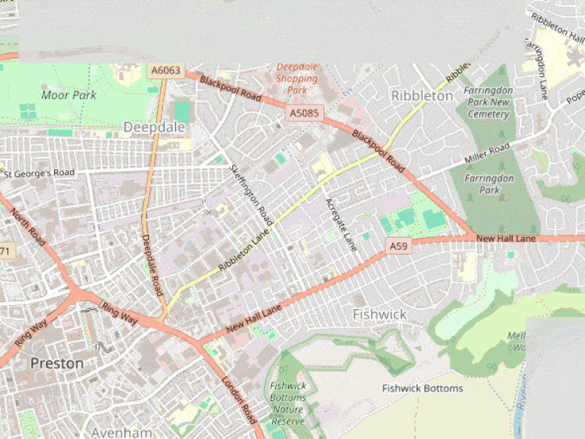
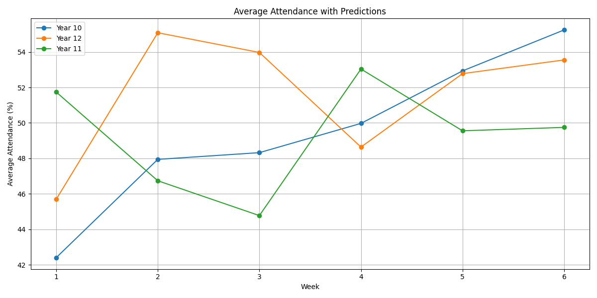
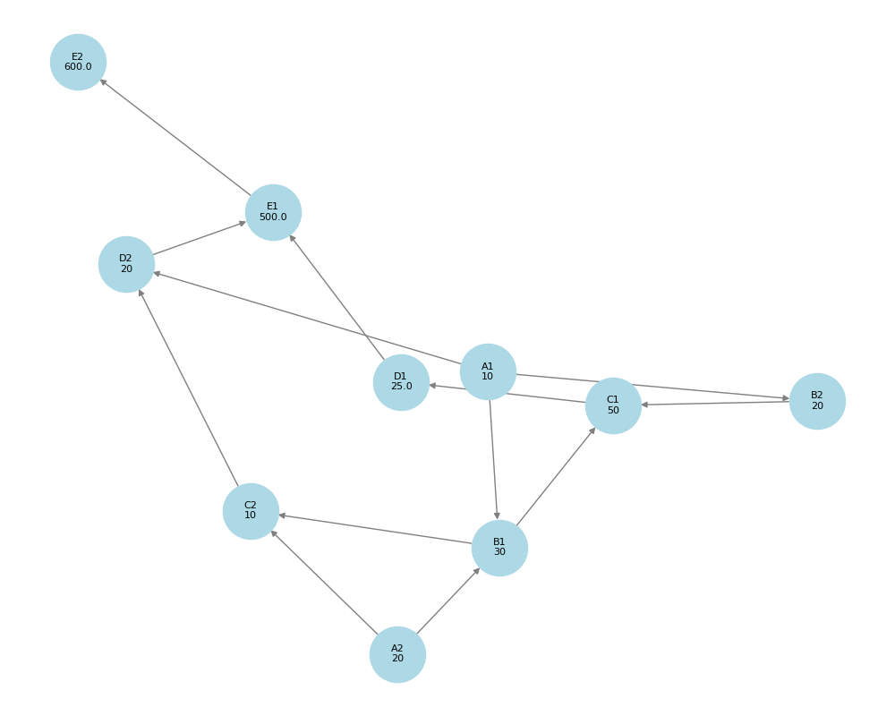
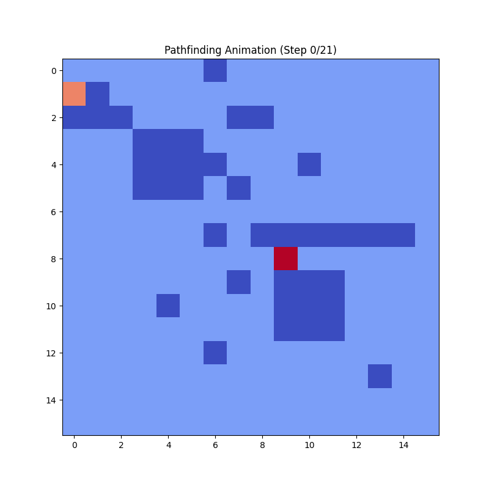

## Python Code Challenge
Series of code challenges for Python (local club) 

1. [Optimal Delivery Routes](optimal_delivery_routes/main.py) 
Consume locations and define the best route from the start.  

 

2. [Predict Average Student Attendance](predict_average_student_attendances/main.py) 
Consume and aggregate student data for the past 4 weeks and predict the next 2 weeks.
  

 

3. [Dependency Graph](dependency_graph/main.py) 
Generate a dependency graph from input cells. Parse formulae into ASTs and perform topological sort. 
  

 

4. [Simple Pathfinder](simple_pathfinder/main.py) 
Simple pathfinding (mimic) robot, allowing movement only up/down/left/right with awareness using the Manhattan Distance Heuristic and A* Search Algorithm.
  
